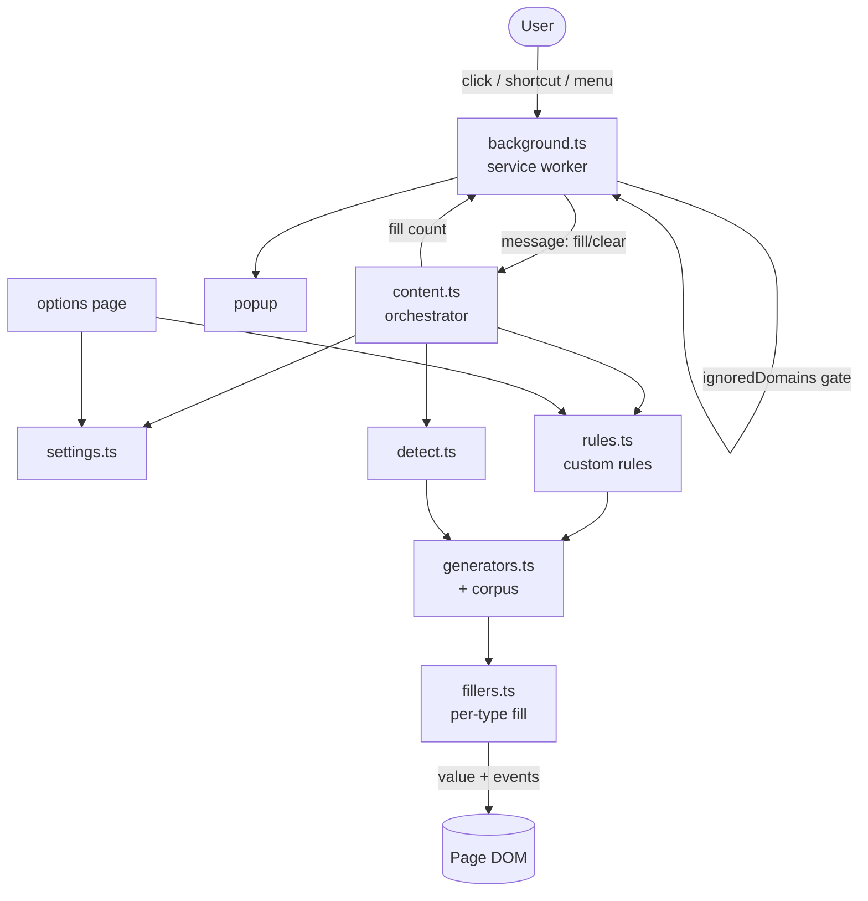
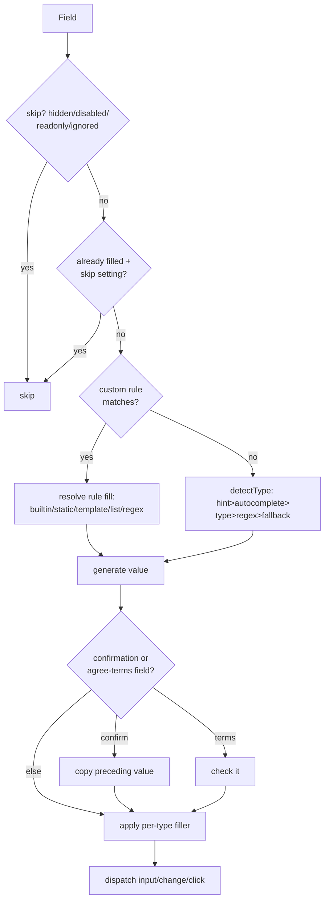

# Input Filler - Plan

A cross-browser (Chromium + Firefox) Manifest V3 browser extension, built on WXT, that fills every form field on the current page with realistic, locally-generated, human-readable data via a toolbar button, keyboard shortcut, and context menu. v1 also ships smart field detection, a typed settings model, and a user-defined Custom Field Rules engine. See origin: `PLAN.md`.

## Goal Capsule

- **Objective:** Deliver a buildable, tested v1 of Input Filler that fills/clears forms with readable data on Chromium-based browsers and Firefox, with detection, settings, and custom rules — ready to package and (later) QA/publish on a browser-equipped machine.
- **Authority:** `PLAN.md` (origin) is the product/feature source. This plan's Product Contract (R-IDs, Key Decisions) governs WHAT; Planning Contract KTDs govern HOW. On conflict, R-IDs win on behavior and KTDs win on mechanism; this enriched plan supersedes the origin where they differ.
- **Stop conditions:** Definition of Done is met; or a genuine blocker is surfaced (for example, a WXT/MV3 incompatibility that invalidates the approach) rather than guessed around.
- **Execution profile:** Greenfield `code`; TypeScript throughout; test continuously — pure-function unit tests for generators/detection/rules plus jsdom DOM-integration tests for fillers and content orchestration.
- **Tail ownership:** Standalone. `ce-work` owns the build/review/commit/ship tail after this plan.

---

## Product Contract

### Summary

Build Input Filler v1 as a WXT/Manifest V3 extension for Chromium and Firefox: fill-all-forms, fill-single-form, and clear actions triggered by toolbar button, shortcut, and context menu, producing fresh realistic data (names, emails, addresses, real sentences) locally with no network access. Ship smart field detection, a versioned settings model in `browser.storage.sync`, and a Custom Field Rules engine with a slim CRUD/import-export UI. Safari, large-scale corpus ingestion, the richer rules UI, store publishing, and live browser QA are deferred.

### Problem Frame

QA, demos, and form-testing all need forms filled with data that looks real in screenshots and behaves correctly under modern SPA validation — not `xkj4f9` placeholder noise and not lorem-ipsum nonsense. The origin (`PLAN.md`) specifies a one-codebase, multi-browser extension that generates readable data locally, detects field intent, and lets users override detection with their own rules. This plan turns that specification into an implementation-ready artifact scoped to a buildable, testable v1.

### Requirements

**Trigger & control**

- R1. The extension fills every fillable form field on the active tab on demand via toolbar button, keyboard shortcut, and (when enabled) context menu.
- R2. The extension fills only the `<form>` containing the currently focused field on demand ("fill this form").
- R3. The extension clears form field values on demand.
- R4. Triggering is a no-op on origins matching the user's blocklist (`ignoredDomains`).

**Readable data**

- R5. All generated data is realistic and human-readable, produced locally with no network access on any browser.
- R6. Every fill action produces fresh data; repeated fills yield different readable values.
- R7. Generated text respects the lesser of the field's own `maxlength` and the configured default max length, trimming at sentence boundaries without mid-word cuts.
- R8. Generic text fields receive coherent real-sentence text from a themeable corpus (not lorem-ipsum), with a grammatical template-grammar fallback when no corpus sentence fits.

**Field detection**

- R9. Each field's logical type is detected by priority: explicit `data-fake` hint, then `autocomplete`, then input `type`, then regex over the configured match attributes (`name`/`id`/`label`/`placeholder`/`aria-*`/`class`), then an element-type fallback.

**Filling behavior**

- R10. Each input type is filled appropriately: text-like inputs/textareas set the value; checkboxes toggle; radios pick one per group; selects choose a valid (non-disabled) option; range/number/date/color respect their constraints; passwords follow password settings.
- R11. Filling dispatches DOM events (`input`, `change`, and `click` where relevant) so SPA frameworks (React/Vue/Angular) update their state.
- R12. Confirmation fields (e.g. "confirm password") copy the immediately preceding field's value; agree-to-terms checkboxes are always checked.
- R13. Hidden, disabled, readonly, and explicitly ignored fields are skipped; pre-filled fields are optionally skipped.

**Settings & storage**

- R14. All preferences persist via `browser.storage.sync` with a local fallback and survive schema changes through versioned migration on load.
- R15. Configurable options cover password mode/length/fixed value/log toggle; ignored fields; hidden/invisible and already-filled skips; confirmation and agree-to-terms matchers; match attributes; default max length; event triggering; context menu; ignored domains; text theme; and UI theme.

**Custom field rules**

- R16. Users define rules that match fields (by `name`/`id`/`label`/`type`/CSS selector and site URL pattern) and override auto-detection with custom fill data: a builtin generator, static text, a template, a list, or a regex.
- R17. Rules evaluate in priority order with first-match-wins; the engine resolves template placeholders against builtin generators, generates regex-matching strings, and supports import/export of rule sets as JSON.

**Cross-browser & privacy**

- R18. One codebase builds and runs on Chromium-based browsers (Chrome/Edge/Brave) and Firefox through WXT, with per-target manifest differences handled in configuration.

### Key Decisions

- KD1. v1 browser scope is Chromium + Firefox only; Safari is deferred. (session-settled: user-directed — chosen over full five-browser scope including Safari: Safari needs macOS/Xcode that cannot run in this environment.) Governs R18.
- KD2. v1 ships a modest, hand-curated real-sentence corpus per theme with a template-grammar fallback; large-scale license-clean ingestion (Project Gutenberg/Tatoeba) is deferred. (session-settled: user-directed — chosen over large-scale ingestion as an in-scope v1 unit: keeps v1 buildable and the corpus unambiguously license-clean.) Governs R8, R5.
- KD3. v1 Custom Field Rules UI is CRUD plus priority ordering, enable/disable, and import/export; richer UX (drag-reorder, live "test rule" against page fields, presets, right-click quick-add) is deferred. (session-settled: user-directed — chosen over the full §5.5 surface: the engine logic is the valuable core; the rich UX can follow.) Governs R16, R17.
- KD4. v1 settings ship the practical core, including confirmation-field copy and agree-to-terms (low-effort, high-value); niche Fake Filler parity items beyond those are deferred. (session-settled: user-directed — chosen over full §7 parity: focuses v1 on readable-data essentials.) Governs R15, R12.

### Acceptance Examples

- AE1. **Covers R1, R5, R6, R10, R11.** Given a page with a name, email, and textarea; when the user clicks Fill all forms; then each field is set to fresh readable data and `input`/`change` events have fired (an SPA counter bound to those events reflects the new values).
- AE2. **Covers R12.** Given a form with `password` then `confirm_password`; when filled; then the confirm field's value equals the password field's value. Given an `agree_terms` checkbox; when filled; then it is checked.
- AE3. **Covers R4, R13.** Given the active origin matches an `ignoredDomains` entry; when the user triggers fill; then nothing is filled. Given a hidden/disabled/readonly field; when filled; then it is skipped.
- AE4. **Covers R7, R8.** Given a textarea with `maxlength="40"`; when filled; then it receives corpus text trimmed at a sentence boundary to ≤40 chars, or a single readable word/short grammar sentence if none fits.

### Scope Boundaries

**Deferred for later (v2+)**

- Safari build/packaging (KD1).
- Large-scale license-clean corpus ingestion and corpus growth tooling (KD2).
- Richer Custom Field Rules UI: drag-to-reorder, live "test rule" against page fields, presets, right-click "Fill this field with…" quick-add (KD3).
- Niche Fake Filler settings parity beyond the practical core (KD4).
- Per-site saved profiles / field memory; full-settings import/export; i18n; on-device AI-assisted generation.

**Outside this product's identity (non-goals per origin)**

- Saving or submitting form data.
- AI-based content generation in v1 (data is generated locally and instantly).
- Any network permission or remote data fetch (R5).

#### Deferred to Follow-Up Work

- Live cross-browser QA on real Chrome, Edge, Brave, and Firefox (cannot execute in this build environment).
- Store publishing: Chrome Web Store, Microsoft Edge Add-ons, AMO (Firefox) — requires store accounts.
- Safari Xcode packaging via `xcrun safari-web-extension-converter` — requires macOS/Xcode.

---

## Planning Contract

### Key Technical Decisions

- KTD1. **WXT is the build/framework layer.** Vite-based, TS-first, auto-generates per-browser manifests, and polyfills the promise-based `browser` namespace. Chosen over hand-rolling per-browser manifests and `webextension-polyfill`; one config drives all targets (origin §0, §2, §9).
- KTD2. **TypeScript throughout; import `browser` from `wxt/browser` only.** Never use raw `chrome.*`; WXT's typings surface cross-browser API divergence at compile time (origin §9).
- KTD3. **MV3 service-worker background with messaging.** The background service worker handles the toolbar action, commands, and context menu, and messages the content script to fill/clear. Content is injected via `activeTab`/`scripting` on user action (origin §3, §8).
- KTD4. **Detection priority is hint → autocomplete → type → regex → fallback.** A single ordered resolver returns one logical type per field; `matchFieldsUsing` controls which attributes the regex stage inspects (origin §4.2; see R9).
- KTD5. **Fillers dispatch synthetic events for SPA state sync.** After setting a value, dispatch `InputEvent('input')` and `Event('change')`; for checkboxes/radios also dispatch `click`. This is what lets React/Vue/Angular validators see the change (origin §4.3; see R10, R11).
- KTD6. **`dummyText(maxLen)` trims at sentence boundaries with a grammar fallback.** It draws from the themeable corpus, joins sentences while budget allows, and falls back to a subject+verb+object grammar when no corpus sentence fits — never cutting mid-word (origin §4.1; see R7, R8).
- KTD7. **Custom rules compile to regex once and cache; first-match-wins in priority order; `urlPattern` scopes per-site.** Compilation happens when rules are loaded, so hundreds of rules add negligible per-fill latency (origin §5.2, §5.6; see R16, R17).
- KTD8. **Versioned settings in `browser.storage.sync` with a local fallback and a load-time migrator.** `settingsVersion` drives forward-only migration so new fields are added without breaking saved user data (origin §5.6, §7.4; see R14).
- KTD9. **Tests are Vitest with jsdom for DOM integration, alongside pure-function unit tests.** Generators/detection/rules are unit-tested as pure functions; fillers and content orchestration get jsdom DOM-integration tests covering grouping, constraints, and event dispatch. (session-settled: user-directed — chosen over unit-only: the confirmed balanced v1 includes DOM integration tests.)
- KTD10. **Package manager is npm.** Origin-specified; `npm`, `wxt`, and `vitest` commands are the canonical scripts. (pnpm is an acceptable substitute but npm keeps commands identical to the origin and to store build pipelines.)

### High-Level Technical Design

The extension is a small set of cooperating surfaces: a background service worker (triggers + gating), a content script (orchestration + DOM), shared pure libraries (generators, detection, fillers, rules, settings), and two UI surfaces (popup, options). The libraries are framework-agnostic and fully unit-testable; the content script is their integration point and is tested via jsdom.



Fill-all is a short request/response across the message boundary, looping over each field inside the content script:

```mermaid
sequenceDiagram
  participant U as User
  participant B as background.ts
  participant C as content.ts
  participant D as DOM
  U->>B: toolbar click / shortcut / menu
  B->>B: ignoredDomains check
  B->>C: { action: fillAll }
  C->>D: query input/textarea/select
  loop each field
    C->>C: rule match? else detectType
    C->>C: generate readable value
    C->>D: set value; dispatch input + change
  end
  C-->>B: { filled: N }
  B-->>U: popup shows count
```

Per field, the orchestrator runs a skip gate, then chooses rule-resolution or auto-detection, then generates a value, applies confirmation/agree-terms overrides, and fills with events:



Rule fill resolution maps each fill kind to a strategy:

| Fill kind | Value source | Output example |
|---|---|---|
| builtin | named generator (`firstName`, `email`, …) | `Eleanor` |
| static | literal string | `test@example.com` |
| template | `{placeholders}` resolved against generators | `eleanor.whitfield@mail.com` |
| list | comma-separated; one chosen at random | one of `SAVE10,SAVE20,SAVE30` |
| regex | random string matching the regex | `ORD-482931` |

Template and regex resolution have their own small pipeline (regex is generated from the pattern; template tokens are resolved left-to-right against builtin generators, then concatenated):

```mermaid
flowchart LR
  T[template "{firstName}.{lastName}@mail.com"] --> P[parse tokens]
  P --> G[resolve each token via generators]
  G --> J[join]
  J --> O[eleanor.whitfield@mail.com]
  R[regex "ORD-\\d{6}"] --> RG[generate matching string]
  RG --> O2[ORD-482931]
```

### Open Questions

- Exact current WXT entrypoint/manifest conventions (content-script config, `commands` registration, popup/options entrypoint shape) — verify against current WXT docs during implementation; no web access was available at planning time.
- Corpus license provenance — v1 ships hand-curated sentences that are unambiguously license-clean; record each theme bank's provenance in the corpus files.
- Closed Shadow DOM support — v1 targets open shadow roots and same-origin iframes; closed roots are an edge case to revisit if real sites require it.

---

## Implementation Units

**Unit Index**

| U-ID | Title | Key files | Depends on |
|---|---|---|---|
| U1 | Scaffold WXT project + tooling | `wxt.config.ts`, `package.json`, `tsconfig.json`, `entrypoints/background.ts`, `entrypoints/popup/*`, `vitest.config.ts`, `.gitignore` | — |
| U2 | Wordlists, generators, corpus | `src/lib/wordlists.ts`, `src/lib/generators.ts`, `src/lib/text.ts`, `src/lib/corpus/*.json`, `tests/generators.test.ts` | U1 |
| U3 | Field-type detection | `src/lib/detect.ts`, `tests/detect.test.ts` | U1 |
| U4 | Per-type fillers + event dispatch | `src/lib/fillers.ts`, `tests/fillers.test.ts` | U2 |
| U5 | Settings model + storage + migration | `src/lib/settings.ts`, `src/lib/env.ts`, `tests/settings.test.ts` | U1 |
| U6 | Custom Field Rules engine | `src/lib/rules.ts`, `tests/rules.test.ts` | U2, U3 |
| U7 | Content orchestration | `entrypoints/content.ts`, `entrypoints/content.style.css`, `tests/content.test.ts` | U2, U3, U4, U5, U6 |
| U8 | Background: action/commands/menu | `entrypoints/background.ts`, `tests/background.test.ts` | U5, U7 |
| U9 | Popup UI | `entrypoints/popup/index.html`, `entrypoints/popup/main.ts`, `entrypoints/popup/style.css` | U5, U8 |
| U10 | Options page + slim rules UI | `entrypoints/options/*`, `src/lib/rules-ui.ts`, `tests/rules-ui.test.ts` | U5, U6 |
| U11 | Edge cases + cross-target build | `entrypoints/content.ts`, `wxt.config.ts`, `tests/content.test.ts` | U1, U7 |
| U12 | Icons, README, packaging | `public/icon/*`, `README.md`, `wxt.config.ts`, `.gitignore` | U1 |

### Phase A — Foundation

### U1. Scaffold WXT project + tooling

- **Goal:** Stand up a building, type-checking, test-running WXT project that produces both Chromium and Firefox MV3 outputs from one config.
- **Requirements:** R18.
- **Dependencies:** —
- **Files:** `package.json`, `tsconfig.json`, `wxt.config.ts`, `entrypoints/background.ts` (stub), `entrypoints/popup/index.html`, `entrypoints/popup/main.ts`, `entrypoints/popup/style.css`, `vitest.config.ts`, `.gitignore`.
- **Approach:** Scaffold a WXT TypeScript project; declare minimal manifest (permissions `activeTab`, `storage`, `contextMenus`, `scripting`; host `<all_urls>`; `commands` for `fill-all`/`fill-form`) with per-browser differences in `wxt.config.ts`. Wire Vitest with jsdom environment and ESLint/Prettier. Ship a trivial popup and background stub to prove the build.
- **Execution note:** Prefer smoke/runtime verification over unit coverage — the proof is that both build targets emit and `npm test` runs.
- **Patterns to follow:** WXT entrypoint conventions (origin §2 structure).
- **Test scenarios:**
  - Happy path: `npm run build` emits `.output/chrome-mv3` and `.output/firefox-mv3`.
  - Integration: `npm test` runs the Vitest suite (no failures from configuration).
  - Integration: TypeScript typecheck passes after `wxt prepare`.
- **Verification:** Both MV3 outputs exist; `npm test` runs; typecheck is clean.

### U2. Wordlists, generators, and real-sentence corpus

- **Goal:** Deliver the readable-data core — pure generators and a themeable `dummyText(maxLen)` backed by a hand-curated corpus with a grammar fallback.
- **Requirements:** R5, R6, R7, R8. Governs KD2.
- **Dependencies:** U1.
- **Files:** `src/lib/wordlists.ts`, `src/lib/generators.ts`, `src/lib/text.ts`, `src/lib/corpus/general.json`, `src/lib/corpus/business.json`, `src/lib/corpus/tech.json`, `src/lib/corpus/casual.json`, `src/lib/corpus/support.json`, `src/lib/corpus/reviews.json`, `tests/generators.test.ts`.
- **Approach:** Implement wordlists (first/last names, cities, states, zips, streets, companies, job titles, domains) and pure generators (`firstName`, `lastName`, `fullName`, `email`, `username`, `phone`, `street`, `city`, `state`, `zip`, `country`, `company`, `jobTitle`, `url`, `sentence`, `paragraph`, `number`, `date`, `color`, `password`). Implement `dummyText(maxLen, theme)` in `text.ts`: sample corpus sentences without immediate repeats, join while budget allows, trim at sentence boundaries; fall back to a subject+verb+object grammar when no sentence fits. Keep page-level consistency where it matters (email derives from the chosen name).
- **Execution note:** These are pure functions — implement test-first; assert freshness and length-fit before treating any generator as done.
- **Patterns to follow:** Generator table and readability engine in origin §4.1.
- **Test scenarios:**
  - Happy path: each generator returns a correctly-shaped value (email matches an email pattern; phone matches the expected format; `url` is absolute).
  - Happy path: `fullName` and `email` stay consistent (the email local-part derives from that name).
  - Edge case: `dummyText(maxLen)` never exceeds `maxLen` and never cuts mid-word; with a very small budget it returns a single readable word or a short grammar sentence.
  - Edge case: `password()` meets common rules (length, mixed case, digit, symbol) given default settings.
  - Edge case: `number(min,max)` respects bounds and `step`; `paragraph(n)` joins exactly `n` sentences.
  - Error path: a missing/empty theme bank falls back to the grammar generator without throwing.
  - Integration: `dummyText` across 100 calls on the same theme avoids immediate repeats and varies output.
- **Verification:** `tests/generators.test.ts` passes; no generator exceeds its length contract.

### U3. Field-type detection

- **Goal:** Return one logical type per field using the ordered resolver.
- **Requirements:** R9.
- **Dependencies:** U1.
- **Files:** `src/lib/detect.ts`, `tests/detect.test.ts`.
- **Approach:** Implement `detectType(field, settings)` with priority hint → autocomplete → type → regex over `matchFieldsUsing` attributes → element fallback (`<textarea>`→paragraph, text→sentence, `<select>`→select). Accept a plain descriptor (attributes + tag) so the resolver is testable without a live DOM where helpful, but also accept real elements.
- **Execution note:** Test-first on representative attribute combinations; cover each priority tier.
- **Patterns to follow:** Detection priority and regex catalog in origin §4.2.
- **Test scenarios:**
  - Happy path: `data-fake="email"` wins over a conflicting `name`.
  - Happy path: `autocomplete="given-name"` maps to first_name; `type="tel"` maps to phone.
  - Happy path: regex on `name` (`user`→username, `zip`→zip, `street`→street, `company`→company).
  - Edge case: `matchFieldsUsing` excluding `class` prevents a class-only match from firing.
  - Edge case: a `<textarea>` with no signals falls back to paragraph; a bare text input to sentence.
- **Verification:** `tests/detect.test.ts` passes across all priority tiers.

### U4. Per-type fillers and event dispatch

- **Goal:** Apply the right value per input type and dispatch the events SPAs need.
- **Requirements:** R10, R11.
- **Dependencies:** U2.
- **Files:** `src/lib/fillers.ts`, `tests/fillers.test.ts`.
- **Approach:** Implement `fillField(field, type, value)` strategies: text-like sets `.value` then dispatches `input`+`change`; checkbox toggles `checked` and dispatches `click`+`change`; radio picks one per group (round-robin so distinct groups differ); select chooses a random non-disabled option; range/number respect min/max/step; date/color set valid values. Centralize event dispatch in one helper.
- **Execution note:** DOM-integration-first — assert the value is set and the events actually fire on a jsdom element before considering a strategy done.
- **Patterns to follow:** Per-type strategies and event dispatch in origin §4.3.
- **Test scenarios:**
  - Happy path: setting a text input's value fires both `input` and `change`.
  - Happy path: checkbox becomes checked and fires `click`+`change`.
  - Integration: two radio groups each end with exactly one option selected, and the two selections differ.
  - Edge case: select never picks a disabled option.
  - Edge case: number respects `step` and stays within `[min,max]`; range stays within bounds.
  - Edge case: filling a field twice does not throw and leaves a valid value.
- **Verification:** `tests/fillers.test.ts` passes; every strategy both sets the value and fires the expected events.

### U5. Settings model, storage, and migration

- **Goal:** Provide a typed settings object that loads/saves via `browser.storage.sync` (local fallback) and migrates forward across versions.
- **Requirements:** R14, R15. Governs KD4.
- **Dependencies:** U1.
- **Files:** `src/lib/settings.ts`, `src/lib/env.ts`, `tests/settings.test.ts`.
- **Approach:** Define `FillerSettings` (per origin §7), `DEFAULT_SETTINGS`, `loadSettings()` (read sync, fall back to local, merge defaults), `saveSettings()`, and a `settingsVersion`-driven migrator that adds new fields to older saved objects. Put per-browser capability flags in `env.ts`.
- **Execution note:** Test-first on migration: assert an older-version object upgrades cleanly to the current shape.
- **Patterns to follow:** Settings model and defaults/migration in origin §7.
- **Test scenarios:**
  - Happy path: `loadSettings` returns defaults when storage is empty and merges them with partial saved data.
  - Happy path: `saveSettings` then `loadSettings` round-trips the object.
  - Edge case: a saved object with `settingsVersion` below current migrates up, adding missing fields with defaults and preserving existing values.
  - Edge case: malformed stored data falls back to defaults without throwing.
- **Verification:** `tests/settings.test.ts` passes; migration is forward-only and lossless for known fields.

### U6. Custom Field Rules engine

- **Goal:** Match fields against user rules, resolve the chosen fill kind, and fall back to auto-detection when no rule matches.
- **Requirements:** R16, R17. Governs KD3, KTD7.
- **Dependencies:** U2, U3.
- **Files:** `src/lib/rules.ts`, `tests/rules.test.ts`.
- **Approach:** Define `CustomRule` (origin §5.1). Compile matchers to regex once and cache. Implement `matchField(field, rules, {url, mode})`: evaluate rules in priority order, apply `any`/`all` mode, scope by `urlPattern`, first-match-wins. Implement fill resolvers: `builtin` (delegate to generators), `static` (literal), `template` (resolve `{placeholders}` against generators), `list` (random entry), `regex` (generate a matching string). Expose `resolveFill(rule)` returning a value or generator thunk.
- **Execution note:** Test-first on the matcher and each resolver; regex generation is the trickiest — cover repetition and character classes.
- **Patterns to follow:** Rule data model, matching/precedence, and template placeholders in origin §5.
- **Test scenarios:**
  - Happy path: a `field` regex rule matches and its `static` value is returned; `mode:any` matches on one condition.
  - Happy path: `mode:all` matches only when every condition hits.
  - Happy path: template `{firstName}.{lastName}@mail.com` resolves to a consistent email; `list` returns one of the entries; `builtin` delegates to the named generator.
  - Edge case: a `urlPattern` rule does not fire on a non-matching origin.
  - Edge case: regex `ORD-\d{6}` generates a matching string; a pattern with a quantifier produces a valid length.
  - Error path: an invalid regex in a rule is caught and skipped rather than throwing at fill time.
- **Verification:** `tests/rules.test.ts` passes; precedence, modes, and all five fill kinds behave per spec.

### Phase B — Fill pipeline

### U7. Content-script orchestration

- **Goal:** Tie the libraries together: fill-all, fill-current-form, and clear, honoring all skip and override settings.
- **Requirements:** R1, R2, R3, R10, R11, R12, R13.
- **Dependencies:** U2, U3, U4, U5, U6.
- **Files:** `entrypoints/content.ts`, `entrypoints/content.style.css`, `tests/content.test.ts`.
- **Approach:** Implement `fillAllForms()`, `fillCurrentForm(activeElement)` (scope to the owning `<form>`), and `clearAllForms()`. Query `input`/`textarea`/`select`; per field run the skip gate (`type=hidden`, disabled, readonly, `data-fake="skip"`, `ignoreFields`, hidden/invisible, already-filled when configured), then rule-match else `detectType`, generate, apply confirmation-field copy and agree-to-terms overrides, then `fillField`. Listen for messages from the background and return a fill count. Keep `content.style.css` for optional highlight.
- **Execution note:** DOM-integration-first — build the orchestration against a jsdom form fixture covering the skip and override paths before wiring the message listener.
- **Patterns to follow:** Orchestrator responsibilities in origin §4.4; settings honoring in origin §7.2.
- **Test scenarios:**
  - Happy path: a mixed form (text, email, textarea, select, checkbox, radio) is fully filled with appropriate values and events.
  - Happy path: `fillCurrentForm` fills only the focused field's form; other forms on the page are untouched.
  - Happy path: `clearAllForms` resets values and states.
  - Covers AE1, AE2, AE3: fresh readable data with events firing; confirm field copies preceding; agree-to-terms checked; hidden/disabled/readonly skipped.
  - Edge case: a field matching `ignoreFields` is skipped.
  - Edge case: when `ignoreFieldsWithContent` is on, a pre-filled field is left as-is.
- **Verification:** `tests/content.test.ts` passes; skip and override behaviors match AE1–AE3.

### Phase C — Integration surfaces

### U8. Background: toolbar action, commands, context menu

- **Goal:** Turn user triggers into fill/clear messages, gate by domain, and report counts.
- **Requirements:** R1, R2, R3, R4.
- **Dependencies:** U5, U7.
- **Files:** `entrypoints/background.ts`, `tests/background.test.ts`.
- **Approach:** On action click and `fill-all`/`fill-form` commands, read settings, check the active origin against `ignoredDomains` (no-op on match), and message the active tab's content script. Register context-menu items (fill all / fill this form / clear) when `contextMenu` is on; tear them down when off. Relay the returned fill count to the popup. Keep message routing pure and testable by injecting sender/registry seams.
- **Execution note:** Unit-test the routing/gating logic with injected seams; context-menu registration itself is verified at build/runtime.
- **Patterns to follow:** Background responsibilities in origin §3; permissions/commands in origin §8.
- **Test scenarios:**
  - Happy path: a `fill-all` command maps to a `fillAll` message to the active tab.
  - Happy path: an origin matching `ignoredDomains` produces no message (covers AE3).
  - Edge case: toggling `contextMenu` off removes the registered items.
  - Edge case: a command when no active tab/tab content is reachable fails gracefully.
- **Verification:** `tests/background.test.ts` passes; gating and routing behave per spec.

### U9. Popup UI

- **Goal:** Give the user the three primary actions plus status, themed to match settings.
- **Requirements:** R1, R2, R3.
- **Dependencies:** U5, U8.
- **Files:** `entrypoints/popup/index.html`, `entrypoints/popup/main.ts`, `entrypoints/popup/style.css`.
- **Approach:** Render Fill all forms, Fill this form, and Clear buttons; a settings link to the options page; and a footer showing the last fill count. Each button sends the corresponding message to the background and updates the footer with the response. Apply light/dark theme from settings. Keep view code minimal and the messaging contract identical to U8.
- **Execution note:** Verify the message contract and theme application; precise visual polish is confirmed at manual/browser review (deferred).
- **Patterns to follow:** Popup layout in origin §6.
- **Test scenarios:**
  - Happy path: each button sends the correct message and renders the returned count.
  - Happy path: the UI theme matches the stored `theme` setting.
  - Edge case: a failed action shows a graceful status, not an uncaught error.
- **Verification:** Popup buttons produce the expected messages; theme reflects settings.

### U10. Options page and slim rules editor

- **Goal:** Let the user edit all v1 settings and manage custom rules with CRUD, priority, enable/disable, and import/export.
- **Requirements:** R14, R15, R16, R17. Governs KD3, KD4.
- **Dependencies:** U5, U6.
- **Files:** `entrypoints/options/index.html`, `entrypoints/options/main.ts`, `entrypoints/options/style.css`, `src/lib/rules-ui.ts`, `tests/rules-ui.test.ts`.
- **Approach:** Build three settings panels (Password, Field Options, General) bound to the `FillerSettings` model with load-on-open and save-on-change. Build the rules editor in `rules-ui.ts`: list rules with enable/disable toggles, add/edit/delete, priority via up/down (writes `priority`), and import/export JSON. Include the text-theme picker and UI-theme toggle. Validate rule fields before save.
- **Execution note:** Test-first on `rules-ui.ts` CRUD/serialization logic; the DOM binding is verified at runtime.
- **Patterns to follow:** Options model in origin §6/§7; rules data model in origin §5.
- **Test scenarios:**
  - Happy path: editing a setting round-trips through `loadSettings`/`saveSettings`.
  - Happy path: add/edit/delete/toggle a rule updates the rule set; reordering updates `priority`.
  - Happy path: export then import reproduces the same rule set (covers R17).
  - Edge case: importing invalid JSON is rejected with a clear error and no state change.
  - Edge case: a rule with an invalid regex is flagged before save.
- **Verification:** `tests/rules-ui.test.ts` passes; settings and rules round-trip correctly.

### Phase D — Hardening & ship

### U11. Edge cases and cross-target build

- **Goal:** Harden the content script for open shadow roots and same-origin iframes, confirm SPA event coverage, and verify both build targets including the Firefox `gecko` id.
- **Requirements:** R10, R11, R18. Governs KD1.
- **Dependencies:** U1, U7.
- **Files:** `entrypoints/content.ts`, `wxt.config.ts`, `tests/content.test.ts`.
- **Approach:** Extend field discovery to walk open shadow roots and same-origin `<iframe>` documents. Confirm event dispatch covers `input`/`change`/`click` for the frameworks in scope. Set Firefox `browser_specific_settings.gecko.id` and any other per-target manifest differences in `wxt.config.ts`; build and inspect both outputs.
- **Execution note:** DOM-integration-first for shadow/iframe discovery; build verification is the cross-target proof.
- **Patterns to follow:** Cross-browser differences and edge cases in origin §0, §9; deferred Safari noted in Scope Boundaries.
- **Test scenarios:**
  - Happy path: a field inside an open shadow root is discovered and filled.
  - Happy path: a field inside a same-origin iframe is discovered and filled.
  - Integration: filling a React-style controlled input updates its bound state (asserted via an event-counting fixture).
  - Integration: `npm run build` emits valid chrome-mv3 and firefox-mv3 manifests; the Firefox output carries the `gecko.id`.
- **Verification:** Shadow/iframe tests pass; both build targets emit with correct per-browser manifest differences.

### U12. Icons, README, and packaging

- **Goal:** Ship icons, an accurate README, and working `wxt zip` packaging for the v1 targets.
- **Requirements:** R18.
- **Dependencies:** U1.
- **Files:** `public/icon/16.png`, `public/icon/32.png`, `public/icon/48.png`, `public/icon/96.png`, `public/icon/128.png`, `README.md`, `wxt.config.ts`, `.gitignore`.
- **Approach:** Add placeholder icons at the required sizes (clearly marked as placeholders for later branding). Write a README covering dev/build/test commands, the Chromium + Firefox v1 targets, scope, and deferred items (Safari, QA, publishing). Configure icon references in the manifest and confirm `wxt zip` produces zips for both targets; ignore `.output/` and `node_modules/`.
- **Execution note:** This is mostly assets/packaging — prefer build/zip verification over unit coverage.
- **Patterns to follow:** Build & tooling in origin §9.
- **Test scenarios:**
  - Test expectation: none — packaging/assets/config; verified by build and zip output.
- **Verification:** `npm run zip` produces chrome and firefox zips; README is accurate; `.output/` is gitignored.

---

## Verification Contract

| Gate | Command | Proves | Applies to |
|---|---|---|---|
| Unit + DOM tests | `npm test` | Generators, detection, fillers, rules, settings, orchestration, rules UI | All behavior-bearing units |
| Typecheck | `npx wxt prepare && npx tsc --noEmit` | TypeScript correctness across the codebase | All units |
| Lint | `npm run lint` | ESLint/Prettier cleanliness | All units |
| Build | `npm run build` | MV3 outputs for Chromium and Firefox | U1, U11, U12 |
| Package | `npm run zip` | Store-ready zips for both targets | U12 |

Manual browser load (load `.output/chrome-mv3` in Chrome and `.output/firefox-mv3` in Firefox via `about:debugging`) is the only verification that proves true runtime/SPA behavior, and it cannot run in this build environment. It is recorded as a deferred follow-up step to execute on a browser-equipped machine, not as an executable gate here.

---

## Definition of Done

- Global: all behavior-bearing units have passing tests (`npm test` green); `npm run build` emits both chrome-mv3 and firefox-mv3; typecheck and lint are clean; `wxt zip` packages both targets.
- Global: no abandoned/dead-end or experimental code from approaches that did not pan out is left in the diff.
- Global: `README.md` documents dev/build/test commands, the v1 scope, and the deferred items.
- Per unit: that unit's `Verification` field is satisfied and its `Test scenarios` pass (or the documented no-test exception applies).
- Deferred (not blocking done): manual browser smoke on Chrome and Firefox, store publishing, and Safari packaging — recorded under Deferred to Follow-Up Work.

---

## Sources / Research

- Origin: `PLAN.md` — detailed legacy specification (browser matrix, architecture, module details, custom-rules data model, settings model, permissions, build/tooling, phases).
- WXT (`wxt.dev`) — Vite-based, TS-first framework that auto-generates per-browser manifests and polyfills the `browser` namespace. Exact current API conventions are to be verified during implementation; no web access was available at planning time (see Open Questions).
- Greenfield: there is no existing codebase to mine for patterns and no institutional learnings under `<root>/solutions/`. Library design follows the origin's module specs.
